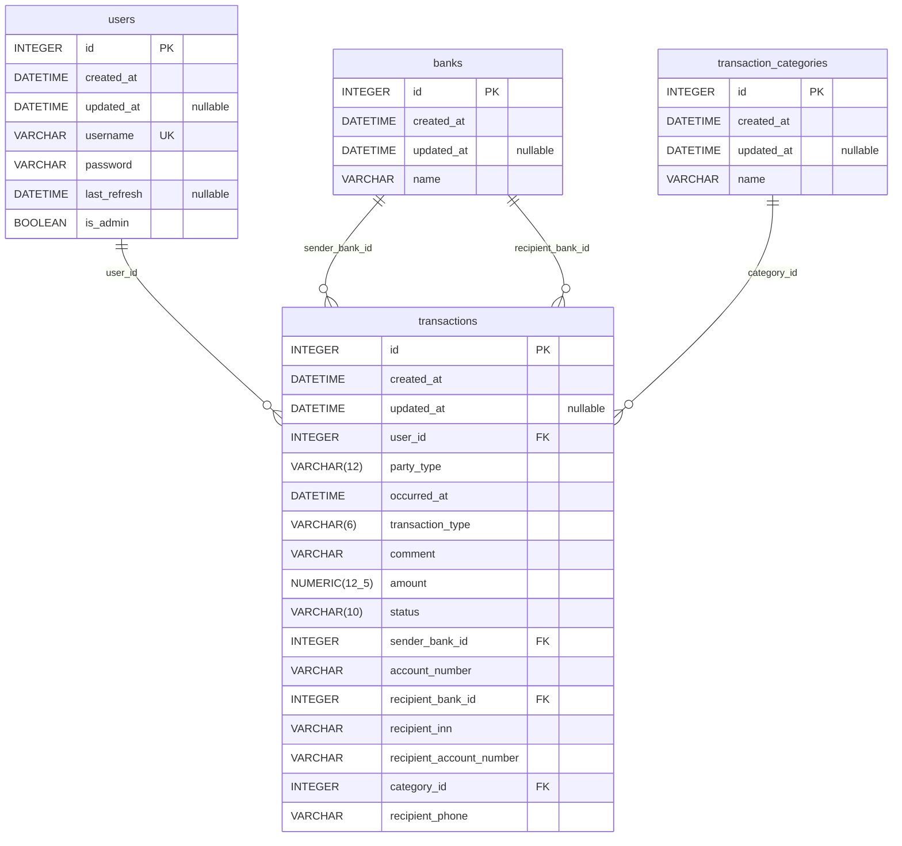

___

# Система контроля финансов

## Схема БД
<!-- BEGIN_DB_SCHEMA_DOCS -->

```mermaid
erDiagram
  users {
    INTEGER id PK
    DATETIME created_at
    DATETIME updated_at "nullable"
    VARCHAR username UK
    VARCHAR password
    DATETIME last_refresh "nullable"
    BOOLEAN is_admin
  }

  transaction_categories {
    INTEGER id PK
    DATETIME created_at
    DATETIME updated_at "nullable"
    VARCHAR name
  }

  transactions {
    INTEGER id PK
    DATETIME created_at
    DATETIME updated_at "nullable"
    INTEGER user_id FK
    VARCHAR(12) party_type
    DATETIME occurred_at
    VARCHAR(6) transaction_type
    VARCHAR comment
    NUMERIC(12_5) amount
    VARCHAR(10) status
    INTEGER sender_bank_id FK
    VARCHAR account_number
    INTEGER recipient_bank_id FK
    VARCHAR recipient_inn
    VARCHAR recipient_account_number
    INTEGER category_id FK
    VARCHAR recipient_phone
  }

  banks {
    INTEGER id PK
    DATETIME created_at
    DATETIME updated_at "nullable"
    VARCHAR name
  }

  users ||--o{ transactions : user_id
  banks ||--o{ transactions : sender_bank_id
  banks ||--o{ transactions : recipient_bank_id
  transaction_categories ||--o{ transactions : category_id

```
<!-- END_DB_SCHEMA_DOCS -->