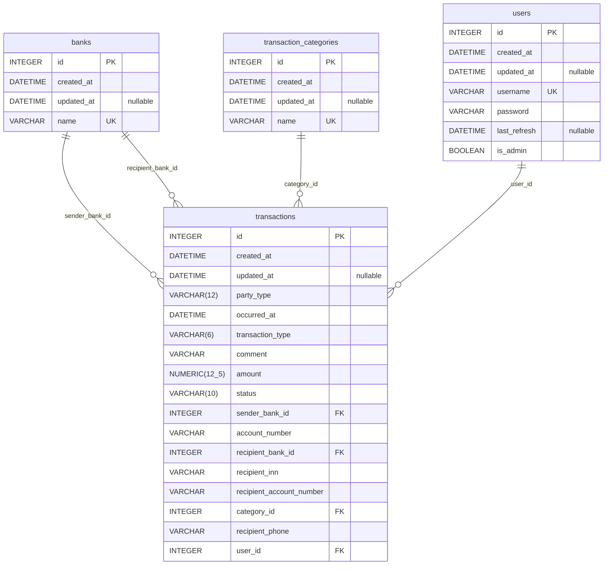

# Система контроля финансов

## Стэк

- Python
- PostgreSQL
- React

## Инструкция по запуску

Инструкцию по запуску бэкенда приложения можно посмотреть [здесь](/backend/README.md). Также там содержится вся необходимая информация по тулингу, который требуется при разработке.

## Схема БД
<!-- BEGIN_DB_SCHEMA_DOCS -->

<!-- END_DB_SCHEMA_DOCS -->

## CI/CD

В качестве основного инструмента CI/CD используется [Github Actions](https://docs.github.com/en/actions/about-github-actions/understanding-github-actions). Настроены следующие этапы:

- **Линтеры и type checking**

    - Код проверяется на соответствие стайлгайду (PEP8 и другим рекомендациям)
    - С помощью статического анализа выявляются вероятные баги еще до запуска сервера
    - Форсится применение best practices
    - Проверяется корректность типизации с помощью [mypy](https://mypy.readthedocs.io/en/stable/index.html) в `strict` режиме

- **Тесты**

    - Unit-тесты
    - Интеграционные тесты с использованием реальной БД
    - Интеграционные тесты с помощью [schemathesis](https://schemathesis.readthedocs.io/en/stable/), который проверяет соответствие эндпоинтов сервера на его же `openapi` спецификацию (что еще называют **Schema-Based Testing**)

- **Отчет о проценте покрытия**

    - На основе этапа тестирования генерируется отчет о том, какие строки кода были задействованы
    - Итоговый отчет сохраняется как артефакт, а общий процент покрытия автоматически сохраняется в **badge**: 

### Dependabot

Также настроена интеграция с [dependabot](https://github.com/dependabot). Он автоматически уведомляет об обнаруженных уязвимостях в зависимостях и делает пулл-реквесты с попыткой поднять версию.